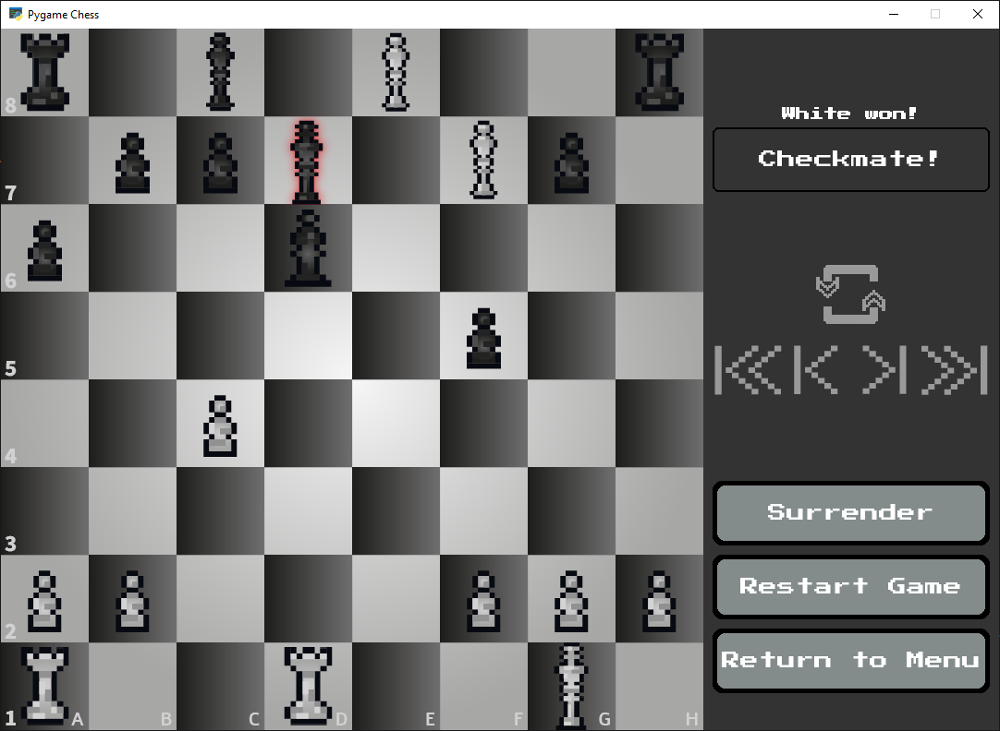
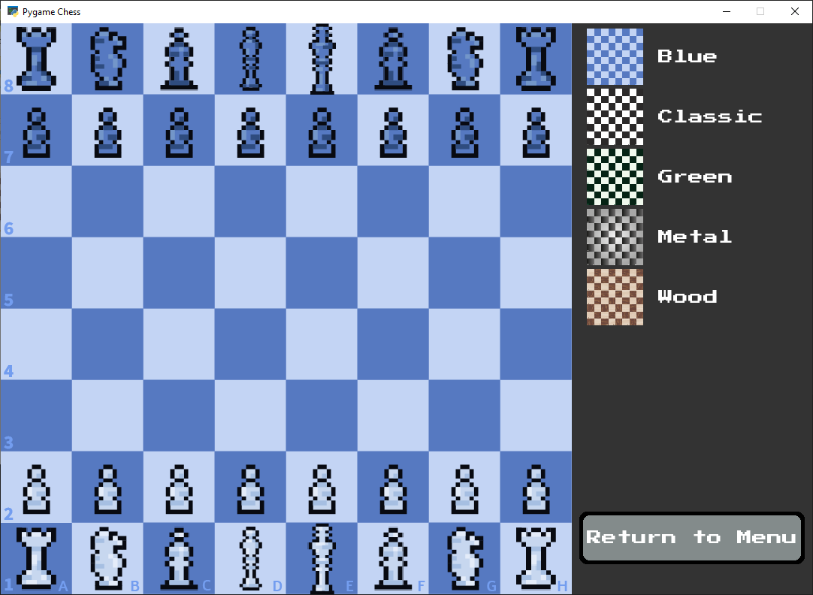
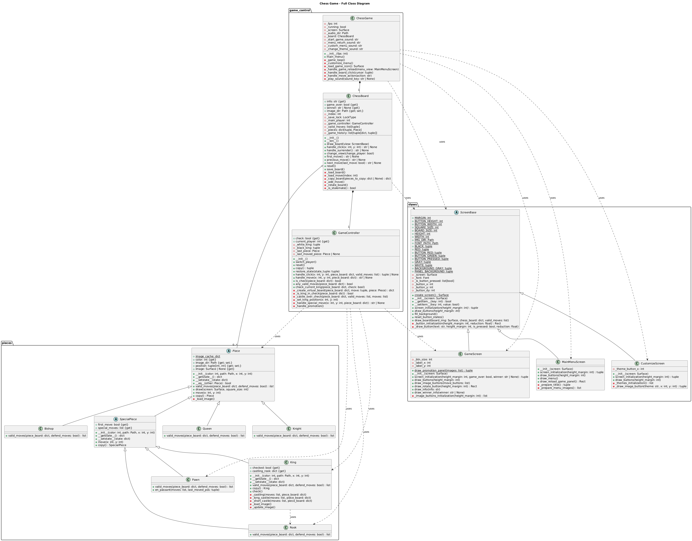
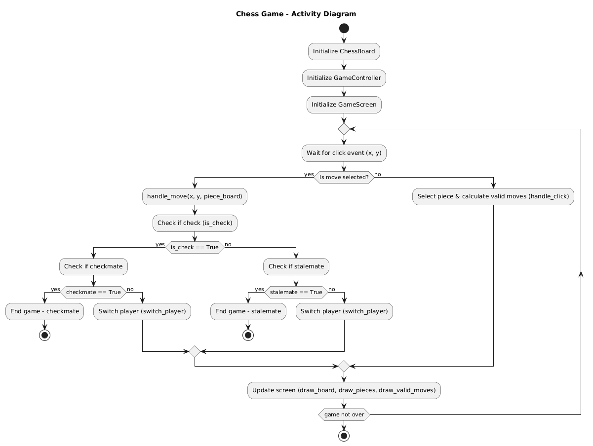

# ♞ Pygame Chess

A local two-player chess game built with Python and Pygame. The game includes custom graphics, a selection of visual themes, sound effects, move history navigation and automatic game saving.


---

## 🎮 Features

- ✔️ Local two-player chess
- ✔️ Custom graphical themes:
  - Blue
  - Classic
  - Green
  - Metal
  - Wood
- ✔️ Move history navigation:
  - Go to first move
  - Step backward
  - Step forward
  - Go to last move
- ✔️ Board rotation based on active player
- ✔️ Sound effects for various game actions
- ✔️ Automatic save and resume of previous game state
- ✔️ Original artwork designed in Adobe Illustrator (MIT licensed)
- ✔️ Full chess rules implemented (castling, en passant, promotion, check, checkmate, stalemate)

---

## 🖼️ Screenshots

### Game in action:
<div align="center">
  
</div>

### Theme selection screen:
<div align="center">
  
</div>

---

## 🚀 How to Run
```bash
git clone https://github.com/aleksanderZak7/pygame-chess.git
cd pygame-chess
python Chess.py
```

---

## ⚙️ Requirements

This project requires Python 3.8+ and the `pygame` library.

### Install dependencies

```bash
pip install pygame
```

---

## 🔊 Sound Effects

- **Check**: [Check](http://images.chesscomfiles.com/chess-themes/sounds/_MP3_/default/move-check.mp3)
- **Castling**: [Castle](http://images.chesscomfiles.com/chess-themes/sounds/_MP3_/default/castle.mp3)
- **Capture**: [Capture](http://images.chesscomfiles.com/chess-themes/sounds/_MP3_/default/capture.mp3)
- **Piece move**: [Move](http://images.chesscomfiles.com/chess-themes/sounds/_MP3_/default/move-self.mp3)
- **Illegal move**: [Illegal](http://images.chesscomfiles.com/chess-themes/sounds/_MP3_/default/illegal.mp3)
- **Promotion**: [Promote](http://images.chesscomfiles.com/chess-themes/sounds/_MP3_/default/promote.mp3)
- **Game end**: [Game End](http://images.chesscomfiles.com/chess-themes/sounds/_MP3_/default/game-end.mp3)
- **Game start**: [Game Start](http://images.chesscomfiles.com/chess-themes/sounds/_MP3_/default/game-start.mp3)
- **Return to menu**: [Menu Selection (Pixabay)](https://pixabay.com/sound-effects/menu-selection-102220/)
- **Customize screen**: [Car Light Switch (Uppbeat)](https://uppbeat.io/sfx/car-light-switch/8507/25046)
- **Theme selection**: [Finger Snap – Raw (SampleFocus)](https://samplefocus.com/samples?search=Finger+Snap+-+Raw)

---

## 📁 Project Structure
```bash
pygame-chess
│
├── Chess.py            # Game entry point
├── src/
│   ├── game_control/   # Game state and core logic
│   ├── pieces/         # Chess piece classes (Pawn, Rook, etc.)
│   ├── views/          # UI screens (menu, game screen, etc.)
│   ├── project_assets/
│   │   ├── audio/      # Sound files
│   │   ├── img/        # Custom images
│   │   ├── SS/         # Screenshots
│   │   └── UML/        # UML diagrams
```

---

## 🧠 UML Diagrams

The project includes the following UML diagrams that illustrate the class structure and gameplay flow:

- **Complete UML Class Diagram:**
<div align="center">
  
</div>

- **Complete UML Game Activity Diagram:**
<div align="center">
  
</div>

---

## 📜 License
This project is licensed under the MIT License - see the [LICENSE](LICENSE) file for details.
